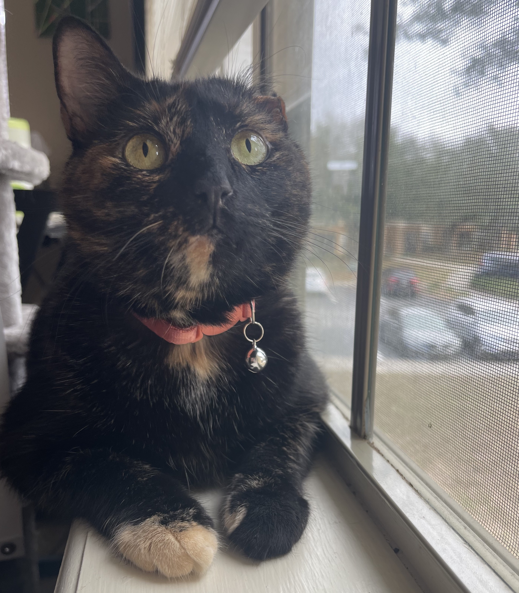

## Hi there!! ☺️

### About Me

Hello! I’m **Nicole Ely** and welcome to my GitHub.

Here you’ll find a little bit of everything, from class projects in database and data analysis courses to personal projects. I have a strong passion for data analysis and telling a story with that data, especially in non-profit settings.

Currently, I’m living a double life as a data analyst for Florida Polytechnic University, as well as an *engineering management master’s student* there as well. I’ve also graduated with my *bachelor’s in data science, with a minor in big data analytics* in 2022 (also from Florida Poly). I also attended New College of Florida for a year previously, where I originally majored in biology, but switched to data science after dipping my toes in for a publication in herpetology. I spend my days using data and predictions to help my team raise money for students, which I think is very fun and cool!

[Cool article showcasing one of my favorite projects!!](https://floridapoly.edu/news/articles/2021/06/062921-intern-ely.php)

There are a few things I’m also passionate about, like my single-eared cat, Kelli. On my remote days, she's the best assistant.

I also love paint-by-numbers, coffee, and listening to cyber crime podcasts in my free time. 

### Research projects I’ve done:

-- [Published] Malaria in Florida’s Native and Invasive Anoles (don’t worry, it only infects reptiles!) 🦎

+ Bessa, L. B., **Ely, N.** M., Calle, E. K., Lafond, B. J., Counsman, R. P., Loges, L. N., & Doan, T. M. (2020). THE EFFECT OF PLASMODIUM FLORIDENSE ON RELATIVE LEUKOCYTE COUNTS OF ANOLIS SAGREI AND A. CAROLINENSIS IN FLORIDA, USA. *Journal of North American Herpetology*, 42–48. https://doi.org/10.17161/jnah.vi.14260

-- [Published] Natural Language Processing for COVID-19 Twitter Data 🐦

+ M. H. Tsai, **N. Marie Ely** and Y. Wang, "Uncertainty Estimation for Twitter Inference," *2021 International Conference on Computational Science and Computational Intelligence (CSCI)*, Las Vegas, NV, USA, 2021, pp. 1437-1440, doi: 10.1109/CSCI54926.2021.00024.

- COVID-19 Text Mining

  

#### Thank you for visiting!

